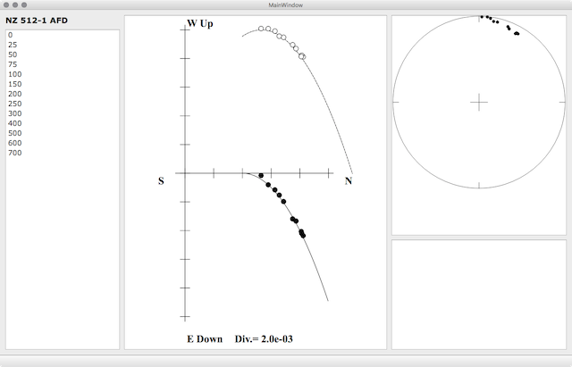

# PyQt5 の例題

ユーザインタフェイス(`view.ui`)は Qt Designer で設計した。HomeBrew で `qt` をインストールした場合は、 `open -a /usr/local/opt/qt/libexec/Designer.app view.ui` で表示・修正できる。

`QGraphicsView` で作成した3つの描画領域の大きさを指定するのに苦労した。これまでのところ QHBoxLayout を用いた試みはすべて失敗し、ひとつのビューだけが拡縮してしまった。現在の実装では QGridLayout を利用し、各描画領域に `stretch` を設定することで調整できた。

ウィンドウのリサイズに応じて拡縮する描画領域にあわせて描画しなおすために、`QGraphicsView`を拡張して時前のクラス`ChartView`を作成した。このクラスは標準の`resizeEvent`メソッドを上書きし、描画領域の大きさが変化するたびに、その大きさにあわせた再描画を促している。

描画は `main.py` で実施している。正確には描画すべき画像オブジェクト群をシーンに登録し、明示的には描画していない。`ChartView`の再描画が求められるときには、自動的に画面が消去され、これらの画像オブジェクト群のデータを用いて、再描画されるらしい。描画・再描画の機能は`ChartView`の親クラスの`QGraphicsView`が司るらしい。
